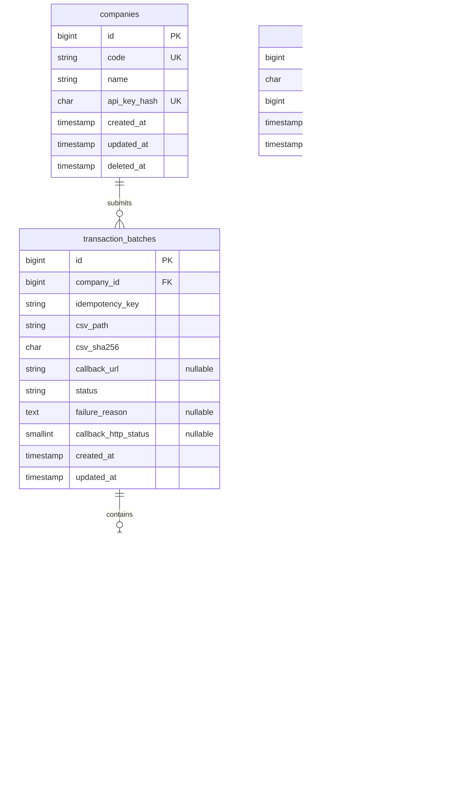

# Database ERD

The diagram below shows the application's core tables and their foreign-key relationships. Account numbers on transactions are stored as values; they are not foreign keys to `accounts`.

`transaction_batches` has a unique constraint on `(company_id, idempotency_key)`. `transactions` has a unique constraint on `(transaction_batch_id, row_number)`.
